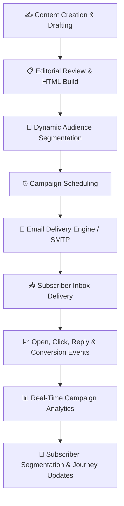
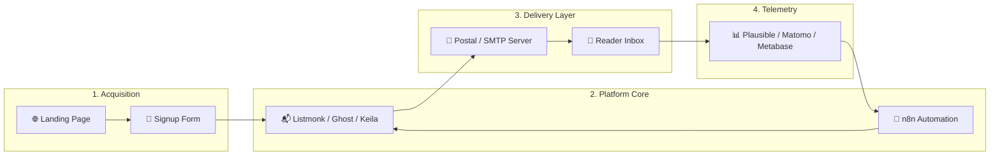

# Awesome-Newsletter-Platform

  

  
  
  
  
  
  
  

---

## 📬 The Ultimate Newsletter & Email Marketing Platform Ecosystem

> 🌐 **Curated Directory of Top SaaS Products & Production-Ready Open-Source GitHub Projects**
> 
> *A comprehensive guide to Newsletter Publishing, Email Marketing Automation, Audience Growth, Subscriber Management, Self-Hosted Email Servers & SMTP Infrastructure.*
>
> 📅 **Last updated: August 2026**

---

### 💡 Overview & Market Landscape

This repository is an authoritative directory tracking the top **commercial SaaS / hosted platforms** and **open-source developer tools** for newsletter creation, email marketing, drip automation, and audience monetization. Whether you are an independent creator launching a Substack alternative, an ecommerce brand scaling high-volume retention funnels, or an enterprise engineering team self-hosting transactional and broadcast email infrastructure, this guide covers every tier of the modern email stack.

---

## 📑 Table of Contents

* [⚡ SaaS/Hosted Platforms](#-saashosted-platforms)
* [🛠️ Open-Source GitHub Projects](#️-open-source-github-projects)
  * [📬 Dedicated Newsletter & Mailing List Platforms](#-dedicated-newsletter--mailing-list-platforms)
  * [📰 Publishing & CMS Platforms with Integrated Newsletters](#-publishing--cms-platforms-with-integrated-newsletters)
  * [🔄 Marketing Automation & Workflow Orchestration](#-marketing-automation--workflow-orchestration)
  * [👥 Subscriber Management & Open-Source CRMs](#-subscriber-management--open-source-crms)
  * [📝 Forms, Surveys & Lead Acquisition](#-forms-surveys--lead-acquisition)
  * [🚀 Self-Hosted Mail Servers & SMTP Infrastructure](#-self-hosted-mail-servers--smtp-infrastructure)
  * [⚡ Developer Email Engines & Notification APIs](#-developer-email-engines--notification-apis)
  * [📊 Audience Analytics, Dashboards & Reporting](#-audience-analytics-dashboards--reporting)
  * [💬 Communities, Discussion Forums & Memberships](#-communities-discussion-forums--memberships)
  * [💳 Payments, Billing & Paid Subscriptions](#-payments-billing--paid-subscriptions)
  * [🌐 Translation & Multilingual Localization](#-translation--multilingual-localization)
* [🧩 Frameworks for Custom Newsletter Architectures](#-frameworks-for-custom-newsletter-architectures)
* [📊 Publishing Workflow & Data Architecture](#-publishing-workflow--data-architecture)
* [🤖 AI-Assisted Newsletter Publishing](#-ai-assisted-newsletter-publishing)
* [📈 Key Newsletter Performance Indicators (KPIs)](#-key-newsletter-performance-indicators-kpis)
* [📈 Star History](#-star-history)
* [🤝 How to Contribute](#-how-to-contribute)
* [📜 Disclaimer](#-disclaimer)

---

## ⚡ SaaS/Hosted Platforms

> 📊 **Market Overview**: The global email marketing software market is estimated at **$1.8B – $12.5B in 2026** (projected to grow at 8.7%–15.4% CAGR) and exhibits a **moderately-to-highly fragmented market structure** where a few multi-billion-dollar giants (such as Intuit Mailchimp and HubSpot) coexist with specialized creator platforms (Beehiiv, Substack, Kit) and niche ecommerce engines without a single winner-take-all monopoly.

The table below ranks major SaaS newsletter and email marketing providers sorted by **Company Size (Valuation / Revenue / Market Cap in descending order)**:

| Product | Company Size (Valuation / Revenue) | Description | Starting Price | Free Tier / Trial Limits |
| :--- | :--- | :--- | :--- | :--- |
| **[HubSpot Marketing Hub](https://www.hubspot.com/products/marketing)** | **~$12.5B Market Cap** (~$3.4B TTM Revenue) | Enterprise inbound marketing, CRM, automated customer journeys, forms, and email marketing platform. | $20/seat/mo (Marketing Hub Starter, billed annually) for up to 1,000 marketing contacts | Free forever: Up to 1,000 non-marketing contacts, 2,000 email sends/month, free CRM, forms, and landing pages |
| **[Mailchimp](https://mailchimp.com/)** | **$12.0B Acquisition Valuation** (~$1.0B+ ARR) | Major email marketing and automation platform supporting newsletters, audience segmentation, campaigns, templates, and analytics. | $13/mo (Essentials plan, up to 500 contacts & 5,000 sends/mo) | Free forever: Up to 250 contacts, 500 email sends/month (daily limit of 500 sends), 1 user seat |
| **[Klaviyo](https://www.klaviyo.com/)** | **~$5.6B Market Cap** (~$1.39B TTM Revenue) | Marketing automation platform focused heavily on ecommerce email and SMS campaigns, customer segmentation, and personalization. | $20/mo (Email plan) for up to 500 active profiles and 5,000 email sends/month | Free forever: Up to 250 active profiles, 500 monthly email sends, and 150 free SMS/MMS credits |
| **[ActiveCampaign](https://www.activecampaign.com/)** | **$3.0B+ Valuation** (~$290M ARR) | Marketing automation and customer experience platform with email campaigns, automation workflows, and CRM capabilities. | $15/mo (Starter plan, billed annually) for up to 1,000 contacts | 14-day free trial with access to core email marketing and automation features (up to 100 contacts/sends during trial) |
| **[Substack](https://substack.com/)** | **$1.1B Valuation** (~$90M–$150M est. ARR) | Direct-to-reader newsletter publishing platform enabling writers to distribute free and paid publications with community discussions. | Free to publish (10% platform fee + ~2.9% + $0.30 Stripe fee only on paid subscriptions) | Free forever: Unlimited subscribers, unlimited email sends, and full publishing features |
| **[Brevo](https://www.brevo.com/)** | **$1.0B Valuation** (~$220M+ ARR) | Customer communication and email marketing platform supporting newsletters, transactional email, automation, and multi-channel messaging. | $9/mo (Starter plan) for up to 5,000 emails/month with no daily sending limits | Free forever: Unlimited contacts, 300 emails/day sending limit (~9,000 emails/month) |
| **[Omnisend](https://www.omnisend.com/)** | **~$550M Valuation** (~$50M ARR) | Omnichannel ecommerce marketing automation platform supporting email, SMS, and automated customer communication. | $16/mo (Standard plan) for up to 500 contacts and 6,000 emails/month + SMS credits | Free forever: Reach up to 250 contacts, 500 email sends/month, up to 60 SMS credits, and unlimited subscriber storage |
| **[Beehiiv](https://www.beehiiv.com/)** | **~$225M Valuation** (~$35M–$48M ARR) | Creator-focused newsletter platform supporting publishing, audience growth, referral programs, analytics, advertising and newsletter monetization. | $43/mo (Scale plan, billed annually) or $49/mo (monthly) for up to 1,000 subscribers | Free forever (Launch plan): Up to 2,500 subscribers, unlimited sends, web hosting, and recommendation network |
| **[Campaign Monitor](https://www.campaignmonitor.com/)** | **~$192M Valuation** (~$60M–$80M ARR) | Email marketing platform by Marigold supporting drag-and-drop campaigns, automation, audience segmentation, and reporting. | $12/mo (Lite plan, billed annually) or $13/mo (monthly) for up to 500 contacts and 2,500 sends/mo | Free trial: Send campaigns to up to 5 test contacts across unlimited trial duration (no permanent free sending tier) |
| **[MailerLite](https://www.mailerlite.com/)** | **~$120M Brand Valuation** (~$18M ARR) | User-friendly email marketing platform offering newsletters, automation, landing pages, forms, and subscriber management. | $10/mo (Comfort plan, billed annually) or $12/mo (monthly) for up to 500 subscribers with unlimited sends | Free forever: Up to 250 subscribers, 2,500 emails/month, 3 automations, 2 user seats |
| **[GetResponse](https://www.getresponse.com/)** | **~$80M–$150M ARR** (Bootstrapped) | Complete email marketing software providing newsletters, marketing automation, landing pages, webinars, and audience management. | $19/mo (Starter plan) for up to 1,000 subscribers and unlimited email sends | Free forever (Free plan): Up to 500 contacts, 2,500 newsletter sends/month, 1 landing page/website builder |
| **[AWeber](https://www.aweber.com/)** | **~$52M ARR** (Bootstrapped) | Long-established email marketing and newsletter platform supporting subscriber lists, autoresponders, and landing pages. | $15/mo (Lite plan, billed annually) for up to 500 subscribers with unlimited email sends | Free forever (Free plan): Up to 500 subscribers, 3,000 email sends/month, 1 landing page, 1 email automation sequence |
| **[Kit](https://kit.com/)** | **~$44M ARR** (Bootstrapped, formerly ConvertKit) | Creator-focused email marketing and newsletter platform supporting subscriber tagging, automations, and audience monetization. | $33/mo (billed annually) or $39/mo (monthly) for up to 1,000 subscribers (Creator plan) | Free forever (Newsletter plan): Up to 10,000 subscribers, unlimited email broadcasts, unlimited landing pages/forms, and 1 visual automation |
| **[Flodesk](https://flodesk.com/)** | **~$36M ARR** (Bootstrapped) | Design-forward email marketing platform focused on visually aesthetic newsletter campaigns, forms, and workflows. | $25/mo (Lite plan) or $28/mo (Pro plan) for up to 1,000 subscribers | 14-day free trial with full sending features (capped at 500 emails/day); transitions to Free plan (forms and landing pages only, no email sending) |
| **[Mailjet](https://www.mailjet.com/)** | **~$16M ARR** (Part of Sinch AB) | Scalable email delivery and marketing platform supporting transactional and marketing email, templates, and SMTP APIs. | $9/mo (Starter plan) for up to 8,000 emails/month with no daily sending limits | Free forever: Up to 6,000 emails/month (capped at 200 emails/day) and 1,000 contact limit |
| **[Ghost](https://ghost.org/)** | **~$10.4M ARR** (Non-profit foundation) | Modern independent publishing and membership platform supporting websites, subscriber management, paid tiers, and native newsletters. | $15/mo (Starter plan, billed annually) or $18/mo (monthly) for Ghost(Pro) managed hosting up to 1,000 members | 14-day free trial of Ghost(Pro) with full features (no credit card required); self-hosted open-source version is 100% free |
| **[Loops](https://loops.so/)** | **~$3.7M Total Funding** (~$750K ARR) | Modern email platform engineered for SaaS and tech startups, combining transactional email and marketing sequences. | $49/mo for up to 2,000 subscribed contacts with unlimited sends and 1,000 emails/sec sending rate | Free forever: Up to 1,000 subscribed contacts, 4,000 email sends/month, 10 emails/sec rate limit (Loops branding included) |
| **[EmailOctopus](https://emailoctopus.com/)** | **~$1.6M ARR** (Bootstrapped) | Lightweight, cost-effective email marketing platform designed for newsletters, subscriber lists, campaigns, and API integrations. | $9/mo (Pro plan, billed annually) or $10/mo (monthly) for up to 1,000 subscribers and 10,000 emails/month | Free forever (Starter plan): Up to 2,500 subscribers and 10,000 email sends/month |
| **[Audienceful](https://www.audienceful.com/)** | **~$1.0M est. ARR** (Bootstrapped) | Lightweight Notion-style newsletter platform designed for audience management, content syndication, and minimal publishing workflows. | $29/mo (Essentials plan, billed annually) or $39/mo (monthly) for up to 3,000 contacts | Free forever: Up to 1,000 contacts, 1 team collaborator, and 1 automated journey (Audienceful branding included) |
| **[Buttondown](https://buttondown.com/)** | **~$400K ARR** (Bootstrapped) | Minimalist, markdown-first newsletter tool built for developers, writers, and technical publishers. | $9/mo (Basic plan) for up to 1,000 subscribers | Free forever: Up to 100 subscribers, unlimited email sends, web archive, and RSS-to-email |

## 🛠️ Open-Source GitHub Projects

All open-source tools below are categorized by functional layer in the modern email publishing architecture and **sorted by GitHub Star Count in descending order**. Each repo includes a live social star badge linking directly to the repository's stargazers.

---

### 📬 Dedicated Newsletter & Mailing List Platforms

* **[Listmonk](https://github.com/knadh/listmonk)**   
  High-performance open-source, self-hosted newsletter and mailing-list manager written in Go with PostgreSQL. Features super-fast campaign dispatch, multi-mailing list management, dynamic templating, subscriber segmentation, custom attributes, and rich REST APIs.

* **[Mautic](https://github.com/mautic/mautic)**   
  World's largest open-source marketing automation ecosystem providing advanced multi-channel drip sequences, dynamic behavioral segmentation, landing page builders, lead scoring, and comprehensive CRM/email integrations.

* **[Mailtrain](https://github.com/Mailtrain-org/mailtrain)**   
  Self-hosted newsletter application built on Node.js and MySQL/MariaDB. Supports large subscriber lists (millions of contacts), custom fields, list segmentation, GPG encryption, click tracking, and custom SMTP/SES delivery.

* **[phpList](https://github.com/phpList/phplist3)**   
  Veteran, battle-tested open-source mailing-list manager and bulk email campaign platform powering email newsletters worldwide for over two decades.

* **[Keila](https://github.com/pentacent/keila)**   
  Modern, privacy-respecting open-source newsletter tool built with Elixir and Phoenix. Features a block editor, Markdown support, double opt-in forms, custom contact fields, and comprehensive GDPR compliance without third-party tracking.

* **[Dittofeed](https://github.com/dittofeed/dittofeed)**   
  Open-source customer engagement and event-driven messaging platform (Segment/Customer.io alternative) written in TypeScript. Enables automated email journeys triggered by product analytics events.

* **[SendPortal](https://github.com/mettle/sendportal)**   
  Open-source email marketing platform built on Laravel. Manages subscriber lists, segments, campaign scheduling, message tracking, and integrations with Amazon SES, SendGrid, Postmark, and Mailgun.

* **[MailPoet](https://github.com/Automattic/mailpoet)**   
  Official WordPress newsletter and email marketing plugin maintained by Automattic. Allows site owners to design responsive newsletters, send automated post notifications, and manage WooCommerce customer lists directly within WP admin.

* **[OpenEMM](https://github.com/agnitas-org/openemm)**   
  Enterprise-grade open-source email marketing software offering automated lead generation, transactional mailings, recipient tracking, and detailed statistical reporting.

* **[BillionMail](https://github.com/aaPanel/BillionMail)**   
  Open-source high-concurrency email marketing system and campaign dispatch engine designed for multi-server delivery, bounce processing, and high-volume subscriber communication.

* **[LetterSpace](https://github.com/LetterSpace/LetterSpace)**   
  Lightweight open-source newsletter publishing application focusing on clean typography, writer-friendly editing interfaces, and modern API architecture.

---

### 📰 Publishing & CMS Platforms with Integrated Newsletters

* **[Hugo](https://github.com/gohugoio/hugo)**   
  Ultra-fast Go-based static site generator commonly used by engineering publications to power static newsletter web archives and landing pages with custom form embeds.

* **[Ghost](https://github.com/TryGhost/Ghost)**   
  Premier open-source publishing platform for independent journalists and creators. Natively integrates web publishing, member subscriptions, free/paid tiers, email newsletters, and audience analytics in a single dashboard.

* **[Jekyll](https://github.com/jekyll/jekyll)**   
  Popular Ruby-based static site generator powering thousands of technical newsletters, developer changelogs, and RSS feeds.

* **[WordPress](https://github.com/WordPress/WordPress)**   
  The world's most widely adopted open-source content management system, easily extended into a full-scale newsletter platform via MailPoet, Newsletter plugin, and custom SMTP plugins.

* **[Drupal](https://github.com/drupal/drupal)**   
  Enterprise open-source CMS powering high-traffic digital publications, media conglomerates, and government newsletters with advanced editorial workflows and permission trees.

* **[WriteFreely](https://github.com/writefreely/writefreely)**   
  Federated, distraction-free open-source publishing network built on ActivityPub and Go, ideal for decentralized blogs and author newsletters.

* **[Publii](https://github.com/GetPublii/Publii)**   
  Open-source privacy-focused desktop CMS for Mac and Windows that builds ultra-fast, secure static websites and email landing pages.

* **[Plone](https://github.com/plone/Plone)**   
  High-security Python enterprise CMS suitable for institutional communications, corporate intranets, and secure member newsletters.

---

### 🔄 Marketing Automation & Workflow Orchestration

* **[Apache Airflow](https://github.com/apache/airflow)**   
  Open-source platform to programmatically author, schedule, and monitor complex batch data pipelines, subscriber synchronization, and automated multi-source newsletter compilation.

* **[n8n](https://github.com/n8n-io/n8n)**   
  Fair-code workflow automation tool with 400+ native integrations. Perfect for connecting signup forms, CRM updates, AI content generation, and email campaign triggers.

* **[Node-RED](https://github.com/node-red/node-red)**   
  Visual flow-based low-code development tool for wiring together hardware devices, external APIs, webhooks, and real-time email notification workflows.

* **[Activepieces](https://github.com/activepieces/activepieces)**   
  Open-source Zapier alternative designed for self-hosters. Automates subscriber registration pipelines, webhook alerts, and third-party SaaS syncing.

* **[Windmill](https://github.com/windmill-labs/windmill)**   
  Fast open-source developer platform and workflow engine for turning scripts (Python, TypeScript, Go, Bash, SQL) into internal tools, scheduled jobs, and custom email pipelines.

* **[Huginn](https://github.com/huginn/huginn)**   
  Open-source system for building autonomous online agents that monitor RSS feeds, web changes, and APIs, generating automated email digest newsletters.

---

### 👥 Subscriber Management & Open-Source CRMs

* **[Odoo](https://github.com/odoo/odoo)**   
  All-in-one open-source business management suite featuring integrated CRM, mass mailing campaigns, contact segmentation, marketing automation, and subscription billing.

* **[Twenty CRM](https://github.com/twentyhq/twenty)**   
  Modern open-source CRM (Salesforce/HubSpot alternative) built with TypeScript and React. Provides custom object modeling, full audience relationship management, and email synchronization.

* **[Monica CRM](https://github.com/monicahq/monica)**   
  Open-source personal and community relationship manager for tracking notes, interactions, birthdays, and individual communication history with readers.

* **[EspoCRM](https://github.com/espocrm/espocrm)**   
  Fast, responsive open-source web application designed to evaluate, categorize, and track subscriber relationships, campaign conversions, and automated communication.

* **[SuiteCRM](https://github.com/salesagility/SuiteCRM)**   
  Enterprise-ready open-source CRM application providing deep contact history, customer life-cycle workflows, email marketing modules, and reporting.

---

### 📝 Forms, Surveys & Lead Acquisition

* **[Formbricks](https://github.com/formbricks/formbricks)**   
  Open-source survey and experience management suite. Collects qualitative feedback, audience preferences, and reader onboarding data directly inside web apps or via email embeds.

* **[SurveyJS](https://github.com/surveyjs/survey-library)**   
  Extensible JavaScript library and UI form-builder component for building complex, interactive multi-page subscriber registration and feedback forms.

* **[LimeSurvey](https://github.com/LimeSurvey/LimeSurvey)**   
  The world's leading open-source statistical survey and questionnaire software for collecting in-depth audience research and subscriber preferences.

* **[OhMyForm](https://github.com/ohmyform/ohmyform)**   
  Open-source Typeform alternative for building beautiful, responsive conversational forms to capture email leads and subscriber survey answers.

* **[Yakforms](https://github.com/Yakforms/yakforms)**   
  Self-hosted, privacy-oriented form builder written in PHP, tailored for community organizations, non-profits, and educational publications.

---

### 🚀 Self-Hosted Mail Servers & SMTP Infrastructure

* **[docker-mailserver](https://github.com/docker-mailserver/docker-mailserver)**   
  Full-stack, production-ready but simple containerized mail server (Postfix, Dovecot, SpamAssassin, ClamAV, OpenDKIM, Fail2ban) configured via environment variables.

* **[Mail-in-a-Box](https://github.com/mail-in-a-box/mailinabox)**   
  One-click turn-key self-hosted email server solution with automated DNS configuration, free TLS certificates via Let's Encrypt, spam filtering, and automated backup.

* **[Mailu](https://github.com/Mailu/Mailu)**   
  Containerized mail distribution system featuring an administrative web UI, webmail (Roundcube/SnappyMail), antispam, antivirus, and DKIM signing.

* **[Postal](https://github.com/postalserver/postal)**   
  Full-featured open-source mail delivery platform (SendGrid/Mailgun alternative) designed for web servers and applications sending high-volume transactional and newsletter mail.

* **[mailcow: dockerized](https://github.com/mailcow/mailcow-dockerized)**   
  Modern, complete email suite with SOGo groupware, Postfix, Dovecot, rspamd, Redis, and an intuitive administrative web interface.

* **[Stalwart Mail Server](https://github.com/stalwartlabs/mail-server)**   
  Next-generation, all-in-one secure mail server written in Rust. Natively implements JMAP, IMAP4, SMTP, SPF, DKIM, DMARC, and ARC with ultra-low memory overhead.

* **[Modoboa](https://github.com/modoboa/modoboa)**   
  Modular mail hosting and management platform written in Python and Django with an intuitive administrative interface, calendar, webmail, and auto-reply support.

* **[Haraka](https://github.com/haraka/Haraka)**   
  High-performance, event-driven SMTP server written in Node.js with extensive plugin architecture capable of processing thousands of incoming messages per second.

* **[SimpleLogin](https://github.com/simple-login/app)**   
  Open-source email alias and privacy protection platform (acquired by Proton) allowing newsletter subscribers and creators to manage disposable forwarding addresses.

* **[AnonAddy](https://github.com/anonaddy/anonaddy)**   
  Anonymous open-source email forwarding service and alias manager built with Laravel, Postfix, and Redis.

* **[Forward Email](https://github.com/forwardemail/free-email-forwarding)**   
  Encrypted, privacy-focused open-source email forwarding and custom domain SMTP service.

---

### ⚡ Developer Email Engines, Templates & Notification APIs

* **[Novu](https://github.com/novuhq/novu)**   
  The open-source notification infrastructure platform for developers. Provides visual workflow builders, multi-channel orchestration (Email, SMS, Push, In-App Chat), and digest engines.

* **[React Email](https://github.com/resend/react-email)**   
  Collection of high-quality, unstyled components for building rich email newsletters using React and TypeScript. Compile modern React components into robust cross-client HTML.

* **[Nodemailer](https://github.com/nodemailer/nodemailer)**   
  The standard Node.js email sending module used by thousands of newsletter backends and serverless functions worldwide.

* **[MJML](https://github.com/mjmlio/mjml)**   
  Markup language designed to reduce the complexity of coding responsive email templates. Transpiles clean semantic tags into responsive HTML compliant with all major email clients.

* **[Apprise](https://github.com/caronc/apprise)**   
  Multi-platform push notification library for Python supporting 80+ notification services and email delivery providers via a unified URL schema.

* **[Plunk](https://github.com/useplunk/plunk)**   
  Open-source email platform built for developers, combining transactional messaging, newsletter broadcasts, and automated drip sequences via an AWS SES backend.

* **[Notifuse](https://github.com/notifuse/notifuse)**   
  Open-source smart notification platform for multi-channel email, SMS, and push communications with automatic contact deduplication and failover.

---

### 📊 Audience Analytics, Dashboards & Reporting

* **[Grafana](https://github.com/grafana/grafana)**   
  The open and composable observability and data visualization platform. Connects to Prometheus, InfluxDB, and SQL databases to monitor real-time email throughput, delivery latency, and bounce spikes.

* **[Apache Superset](https://github.com/apache/superset)**   
  Modern enterprise data exploration and visualization platform capable of slicing and dicing millions of subscriber interaction records and cohort engagement trends.

* **[Metabase](https://github.com/metabase/metabase)**   
  User-friendly open-source business intelligence tool that enables non-technical team members to ask questions, explore subscriber databases, and generate automated email performance dashboards.

* **[Matomo](https://github.com/matomo-org/matomo)**   
  Leading open-source Google Analytics alternative providing complete data ownership, UTM campaign attribution, landing page conversion tracking, and heatmaps.

* **[Umami](https://github.com/umami-software/umami)**   
  Simple, fast, privacy-focused open-source analytics solution with lightweight tracking scripts for newsletter landing pages and signup funnels.

* **[Plausible](https://github.com/plausible/analytics)**   
  Lightweight and open-source website analytics tool built with Elixir. Fully compliant with GDPR, CCPA, and PECR without using cookies or collecting personal data.

* **[Ackee](https://github.com/electerious/Ackee)**   
  Self-hosted, Node.js-based analytics tool for tracking website visitors, views, and referrer sources for independent publications.

---

### 💬 Communities, Discussion Forums & Memberships

* **[Discourse](https://github.com/discourse/discourse)**   
  Modern open-source discussion platform powering community conversations, email digest summaries, member directories, and reader engagement.

* **[Flarum](https://github.com/flarum/flarum)**   
  Delightfully simple, lightweight open-source forum software built with PHP and Mithril.js with lightning-fast discussion threads.

* **[NodeBB](https://github.com/NodeBB/NodeBB)**   
  Next-generation community forum software powered by Node.js, WebSockets, and Redis with real-time notifications and newsletter email digest plugins.

* **[HumHub](https://github.com/humhub/humhub)**   
  Flexible open-source social network kit written in PHP for creating private communities, organization intranets, and interactive membership portals.

---

### 💳 Payments, Billing & Paid Subscriptions

* **[WooCommerce](https://github.com/woocommerce/woocommerce)**   
  Customizable, open-source ecommerce platform built for WordPress. Supports recurring subscriptions, digital product sales, and member-only newsletter paywalls.

* **[Solidus](https://github.com/solidusio/solidus)**   
  Battle-tested open-source ecommerce framework for Ruby on Rails, easily customized for premium memberships, merchandise drops, and recurring digital billing.

* **[Lago](https://github.com/getlago/lago)**   
  Open-source metering and billing infrastructure for usage-based and hybrid subscription revenue models.

* **[Kill Bill](https://github.com/killbill/killbill)**   
  Enterprise-grade open-source subscription billing and payment routing platform supporting multi-currency payment gateways and customized dunning workflows.

---

### 🌐 Translation & Multilingual Localization

* **[LibreTranslate](https://github.com/LibreTranslate/LibreTranslate)**   
  Free and open-source machine translation engine powered by Argos Translate. 100% self-hosted, offline-capable, and private for automated newsletter translations.

* **[Argos Translate](https://github.com/argosopentech/argos-translate)**   
  Open-source offline neural machine translation library written in Python for building automated multi-language newsletter feeds.

* **[Apertium](https://github.com/apertium)**   
  Rule-based machine translation platform especially well-suited for closely related language pairs and minority language publishing.

## 🧩 Frameworks for Custom Newsletter Architectures

A production-ready open-source newsletter publishing system can be modularly composed by combining specialized layers:

* 🎯 **Newsletter Core Engine** → `Listmonk` / `Keila` / `Mailtrain`
* ⚡ **Marketing Automation** → `Mautic` / `Dittofeed`
* 📰 **Publishing Website & Blog** → `Ghost` / `WordPress` / `Hugo`
* 📝 **Subscriber Capture Forms** → `Formbricks` / `SurveyJS`
* 👥 **Audience & Member CRM** → `Twenty CRM` / `EspoCRM` / `SuiteCRM`
* 🔄 **Workflow Orchestration** → `n8n` / `Activepieces` / `Windmill`
* 🚀 **Email Server & SMTP** → `Postal` / `docker-mailserver` / `Stalwart Mail Server`
* 💻 **Developer Email Components** → `React Email` / `MJML` / `Novu`
* 💬 **Community & Discussion** → `Discourse` / `Flarum`
* 💳 **Paid Subscriptions & Paywalls** → `WooCommerce` / `Lago` / `Kill Bill`
* 📊 **Web & Campaign Analytics** → `Plausible` / `Matomo` / `Metabase`
* 🌐 **Multilingual Localization** → `LibreTranslate`

### 💡 Recommended Architecture Stacks:

1. **The Modern Independent Publisher**:  
   `Ghost` (Memberships + Newsletters) + `Stripe` (Payments) + `Plausible` (Privacy Analytics) + `n8n` (Automation).

2. **The High-Scale Lightweight Newsletter (1M+ Subscribers)**:  
   `Listmonk` + `PostgreSQL` + `Postal / Amazon SES` + `React Email` + `Metabase`.

3. **The Marketing Automation & Lead Nurturing Powerhouse**:  
   `Mautic` + `Twenty CRM` + `Postal` + `Formbricks` + `Apache Superset`.

4. **100% Privacy-Focused European Self-Hosted Stack**:  
   `Keila` + `Stalwart Mail Server` + `Matomo` + `n8n` + `LibreTranslate`.

---

## 📊 Publishing Workflow & Data Architecture

---

## 🤖 AI-Assisted Newsletter Publishing

Modern email publishing workflows increasingly leverage AI assistance:

* ✍️ **Drafting & Summarization**: Automated curation of top industry news, TL;DR generation, and article highlights.
* 🎯 **Subject Line & Hook Optimization**: Predictive scoring for subject line open rates and spam-trigger prevention.
* 👥 **Audience Segmentation**: Clustering reader profiles based on click behavior and engagement velocity.
* 🌐 **Automated Translation**: Instant localization into multiple languages using `LibreTranslate`.
* 📉 **Subscriber Churn Prediction**: Early detection of disengaged subscribers for automated re-engagement drip sequences.

---

## 📈 Key Newsletter Performance Indicators (KPIs)

To optimize newsletter growth, deliverability, and monetization, track these critical health metrics:

* 📊 **Deliverability & Inbox Placement Rate**: Target >98% delivery rate with strict SPF/DKIM/DMARC authentication.
* 📬 **Open Rate (OR)**: Target 35%–55% (depending on niche and Apple Mail Privacy Protection adjustments).
* 🖱️ **Click-Through Rate (CTR)**: Target 3%–8% of total delivered emails.
* 🎯 **Click-to-Open Rate (CTOR)**: Target 10%–25% (indicates content relevance among active openers).
* 🚪 **Unsubscribe Rate**: Target <0.3% per broadcast send.
* 💵 **Subscriber Lifetime Value (LTV)** & **Sponsorship CPM**: Core monetization and sustainability metrics.

---

## 📈 Star History

---

## 🤝 How to Contribute

Contributions are warmly welcomed! Help make this ecosystem resource even better:

1. 🍴 Fork the repository.
2. 📝 Add or update entries in `README.md` following the standard table/list formats.
3. 🔗 Include: name, link, concise description, starting price or GitHub star badge, and clear category.
4. ⚙️ Clearly indicate whether an open-source project is a complete newsletter platform, marketing automation engine, email infrastructure, or developer component.
5. ⭐ Prefer actively maintained projects with clear open-source licenses and thorough documentation.
6. 🚀 Submit a Pull Request with a short explanation!

---

## 📜 Disclaimer

* This is a **community-curated index** — not exhaustive and not an endorsement.
* Commercial SaaS pricing, free limits, valuations, and features are subject to change by their respective providers.
* Self-hosted newsletter platforms generally require separate SMTP or email delivery infrastructure.
* Organizations should configure SPF, DKIM, and DMARC and strictly comply with applicable anti-spam (CAN-SPAM, CASL) and privacy (GDPR, CCPA) regulations.
* Analytics metrics such as email opens may be affected by privacy proxies and email-client prefetching behavior.

---

  <b>Made for newsletter creators, publishers, media companies, marketers, communities, developers and organizations building open email publishing infrastructure.</b> 
  Let's make newsletters more <b>open, creator-friendly, privacy-respecting, interoperable and independent</b>.

