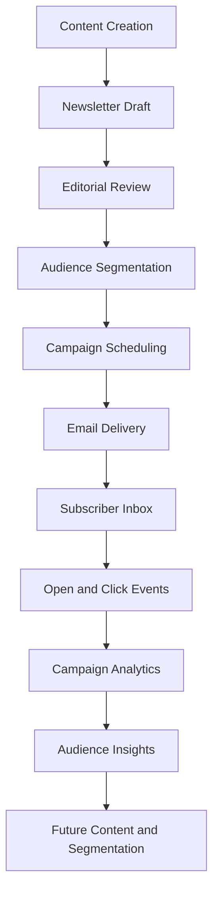
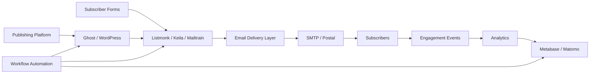
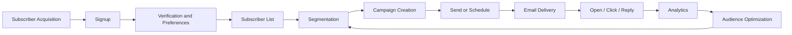

# Awesome-Newsletter-Platform

## Top Newsletter Platform Ecosystem

**Curated List of SaaS Products & Open-Source GitHub Projects**

*Focused on Newsletter Publishing, Email Marketing, Subscriber Management, Audience Growth, Marketing Automation & Self-Hosted Email Infrastructure*

**Last updated: August 2026**

This repository tracks notable **SaaS/hosted platforms** and **open-source projects** for **Newsletter Publishing and Email Marketing**. These tools help creators, publishers, businesses and communities build subscriber lists, create newsletters, send email campaigns, automate sequences, manage audiences, monetize publications, analyze engagement and grow digital audiences.

**Examples** include Beehiiv, Substack, Kit (formerly ConvertKit), Mailchimp, MailerLite, Buttondown, Ghost, Audienceful, Flodesk and Campaign Monitor.

**Open-source emphasis**: This section is heavily expanded with major open-source newsletter platforms, mailing-list managers, marketing automation systems, email campaign tools, publishing platforms, form builders, CRM systems and self-hosted email infrastructure. The open-source ecosystem is particularly strong for organizations that want to own subscriber data, self-host campaigns and integrate newsletter workflows with their own infrastructure.

Contributions welcome! Open a PR to add/update entries. Keep descriptions factual and link to official sites or GitHub repositories.

## Table of Contents

* [SaaS/Hosted Platforms](#saashosted-platforms)

* [Open-Source GitHub Projects](#open-source-github-projects)

* [Additional Strong Open-Source Options](#additional-strong-open-source-options)

* [Frameworks for Building Custom Newsletter Systems](#frameworks-for-building-custom-newsletter-systems)

* [How to Contribute](#how-to-contribute)

* [Disclaimer](#disclaimer)

## SaaS/Hosted Platforms

* **[Beehiiv](https://www.beehiiv.com/)**

  Creator-focused newsletter platform supporting publishing, audience growth, referral programs, analytics, advertising and newsletter monetization.

* **[Substack](https://substack.com/)**

  Newsletter publishing platform enabling writers and publishers to distribute free and paid email publications with subscription and payment features.

* **[Kit](https://kit.com/)**

  Creator-focused email marketing and newsletter platform, formerly known as ConvertKit, supporting subscriber management, automations, landing pages and audience monetization.

* **[Mailchimp](https://mailchimp.com/)**

  Major email marketing and automation platform supporting newsletters, audience segmentation, campaigns, templates, analytics and marketing workflows.

* **[MailerLite](https://www.mailerlite.com/)**

  Email marketing platform offering newsletters, automation, landing pages, forms and subscriber management.

* **[Buttondown](https://buttondown.com/)**

  Lightweight newsletter platform focused on writing, publishing, subscriber management and simple email newsletter workflows.

* **[Ghost](https://ghost.org/)**

  Publishing and membership platform supporting websites, blogs, subscriber management, paid memberships and integrated newsletters.

* **[Audienceful](https://www.audienceful.com/)**

  Newsletter-focused platform designed for audience management, publishing and newsletter growth workflows.

* **[Flodesk](https://flodesk.com/)**

  Email marketing platform focused on visually designed email campaigns, subscriber management, forms and automation.

* **[Campaign Monitor](https://www.campaignmonitor.com/)**

  Email marketing platform supporting campaigns, automation, audience segmentation and reporting.

* **[Brevo](https://www.brevo.com/)**

  Customer communication and email marketing platform supporting newsletters, transactional email, automation and multi-channel messaging.

* **[ActiveCampaign](https://www.activecampaign.com/)**

  Marketing automation and customer experience platform with email campaigns, automation workflows and CRM capabilities.

* **[Klaviyo](https://www.klaviyo.com/)**

  Marketing automation platform focused heavily on ecommerce email and SMS campaigns, customer segmentation and personalization.

* **[Drip](https://www.drip.com/)**

  Ecommerce-focused marketing automation platform supporting targeted campaigns, segmentation and automated customer journeys.

* **[GetResponse](https://www.getresponse.com/)**

  Email marketing platform providing newsletters, automation, landing pages and audience management.

* **[AWeber](https://www.aweber.com/)**

  Long-established email marketing and newsletter platform supporting subscriber lists, campaigns and automation.

* **[Mailjet](https://www.mailjet.com/)**

  Email delivery and marketing platform supporting transactional and marketing email, templates and campaign management.

* **[EmailOctopus](https://emailoctopus.com/)**

  Email marketing platform designed for newsletters, subscriber lists, campaigns and integrations.

* **[Loops](https://loops.so/)**

  Modern email platform focused on SaaS and product-led businesses, with transactional and marketing email workflows.

* **[beehiiv Enterprise](https://www.beehiiv.com/)**

  Enterprise-oriented newsletter infrastructure for larger publishers requiring audience growth and monetization capabilities.

* **[HubSpot Marketing Hub](https://www.hubspot.com/products/marketing)**

  Marketing automation platform combining email campaigns with CRM, forms, landing pages and customer engagement tools.

* **[Omnisend](https://www.omnisend.com/)**

  Ecommerce marketing automation platform supporting email, SMS and automated customer communication.

## Open-Source GitHub Projects

### Dedicated Newsletter and Mailing List Platforms

* **[Listmonk](https://github.com/knadh/listmonk)**

  High-performance open-source, self-hosted newsletter and mailing-list manager built as a lightweight standalone application using PostgreSQL. It supports subscriber management, campaigns, templates, segmentation, analytics and API-based integrations.

* **[Mautic](https://github.com/mautic/mautic)**

  Major open-source marketing automation platform supporting email campaigns, subscriber segmentation, forms, landing pages, lead scoring and multi-step automated workflows.

* **[Keila](https://github.com/pentacent/keila)**

  Modern open-source newsletter platform focused on campaigns, subscriber management, forms and privacy-friendly self-hosted email publishing.

* **[phpList](https://github.com/phpList/phplist3)**

  Mature open-source mailing-list and email marketing platform supporting newsletters, subscriber management and large-scale email campaigns.

* **[Mailtrain](https://github.com/Mailtrain-org/mailtrain)**

  Open-source self-hosted newsletter and email campaign platform supporting mailing lists, templates, subscriber segmentation and email delivery integrations.

* **[SendPortal](https://github.com/mettle/sendportal)**

  Open-source Laravel-based email marketing platform designed for managing subscribers, campaigns, templates and email service provider integrations.

* **[Dittofeed](https://github.com/dittofeed/dittofeed)**

  Open-source customer engagement and messaging platform supporting event-driven campaigns and multi-channel communication workflows.

* **[BillionMail](https://github.com/aaPanel/BillionMail)**

  Open-source self-hosted email marketing and newsletter platform designed for managing campaigns, subscribers and large-scale email communication.

* **[LetterSpace](https://github.com/LetterSpace/LetterSpace)**

  Open-source newsletter publishing project focused on providing a modern user experience and API-driven newsletter management.

* **[OpenEMM](https://github.com/agnitas-org/openemm)**

  Open-source email marketing and campaign management platform supporting mailing lists, campaigns, recipient management and email analytics.

* **[MailPoet](https://github.com/Automattic/mailpoet)**

  Open-source WordPress newsletter and email marketing plugin for creating newsletters and managing subscribers directly from WordPress.

### Publishing Platforms with Newsletter Capabilities

* **[Ghost](https://github.com/TryGhost/Ghost)**

  Major open-source publishing platform combining blogs, websites, memberships, paid subscriptions and integrated newsletter publishing.

* **[WordPress](https://github.com/WordPress/WordPress)**

  Open-source publishing platform that can be extended with newsletter plugins, subscriber management and email marketing integrations.

* **[Drupal](https://github.com/drupal/drupal)**

  Open-source CMS suitable for building large publisher websites and integrating newsletter, membership and audience management capabilities.

* **[Plone](https://github.com/plone/Plone)**

  Open-source content management platform suitable for institutional publishing and subscriber communication workflows.

* **[WriteFreely](https://github.com/writefreely/writefreely)**

  Open-source minimalist publishing platform that can be used as a self-hosted foundation for newsletters and independent publishing.

* **[Publii](https://github.com/GetPublii/Publii)**

  Open-source desktop publishing tool for generating and managing static websites that can be integrated with external newsletter infrastructure.

* **[Hugo](https://github.com/gohugoio/hugo)**

  High-performance open-source static site generator that can serve as a publishing layer for newsletters and subscriber acquisition.

* **[Jekyll](https://github.com/jekyll/jekyll)**

  Open-source static site generator commonly used for blogs and publisher websites, suitable for integration with newsletter systems.

### Subscriber Management and CRM Foundations

* **[SuiteCRM](https://github.com/salesagility/SuiteCRM)**

  Open-source CRM platform that can manage subscriber contacts, communication history and newsletter-related audience workflows.

* **[EspoCRM](https://github.com/espocrm/espocrm)**

  Open-source CRM suitable for managing subscribers, contacts, segments and communication records.

* **[Odoo CRM](https://github.com/odoo/odoo)**

  Open-source ERP and CRM ecosystem that can be extended with marketing, email and customer communication workflows.

* **[Twenty CRM](https://github.com/twentyhq/twenty)**

  Modern open-source CRM platform that can provide a subscriber and audience relationship management foundation.

* **[Monica CRM](https://github.com/monicahq/monica)**

  Open-source relationship management software that can be adapted for smaller community and membership-oriented communication workflows.

### Forms and Subscriber Acquisition

* **[Formbricks](https://github.com/formbricks/formbricks)**

  Open-source survey and form platform suitable for collecting subscriber preferences, feedback and audience information.

* **[LimeSurvey](https://github.com/LimeSurvey/LimeSurvey)**

  Mature open-source survey platform that can support newsletter signup workflows, audience surveys and preference collection.

* **[SurveyJS](https://github.com/surveyjs/survey-library)**

  Open-source survey and form-building framework suitable for building custom newsletter subscription and preference forms.

* **[OhMyForm](https://github.com/ohmyform/ohmyform)**

  Open-source form-building platform that can be used for subscriber acquisition and data collection.

* **[Yakforms](https://github.com/Yakforms/yakforms)**

  Open-source form-building platform suitable for collecting subscriber registrations and feedback.

### Marketing Automation and Workflow Orchestration

* **[n8n](https://github.com/n8n-io/n8n)**

  Open-source workflow automation platform useful for connecting newsletter platforms, CRMs, forms, analytics systems and external APIs.

* **[Node-RED](https://github.com/node-red/node-red)**

  Open-source flow-based automation platform suitable for event-driven newsletter workflows and custom integrations.

* **[Activepieces](https://github.com/activepieces/activepieces)**

  Open-source workflow automation platform that can connect newsletter infrastructure with databases, forms and SaaS applications.

* **[Huginn](https://github.com/huginn/huginn)**

  Open-source automation platform capable of monitoring data sources and triggering custom newsletter workflows.

* **[Apache Airflow](https://github.com/apache/airflow)**

  Open-source workflow orchestration platform suitable for scheduled data pipelines and large-scale newsletter operations.

* **[Windmill](https://github.com/windmill-labs/windmill)**

  Open-source workflow and automation platform useful for building custom subscriber and campaign pipelines.

### Email Infrastructure and Delivery

* **[Postal](https://github.com/postalserver/postal)**

  Open-source mail delivery platform designed for managing outbound email infrastructure and transactional or bulk email workflows.

* **[Haraka](https://github.com/haraka/Haraka)**

  Open-source high-performance SMTP server built with Node.js.

* **[Mail-in-a-Box](https://github.com/mail-in-a-box/mailinabox)**

  Open-source project for deploying and managing self-hosted email infrastructure.

* **[Modoboa](https://github.com/modoboa/modoboa)**

  Open-source email hosting and management platform that can provide mail infrastructure for self-hosted communication systems.

* **[Mailu](https://github.com/Mailu/Mailu)**

  Open-source Docker-based mail server solution.

* **[docker-mailserver](https://github.com/docker-mailserver/docker-mailserver)**

  Open-source production-oriented mail server solution packaged for Docker deployments.

* **[Stalwart Mail Server](https://github.com/stalwartlabs/mail-server)**

  Modern open-source mail server supporting contemporary email infrastructure requirements.

* **[Postal Email API Integrations](https://github.com/search?q=Postal+email+API&type=repositories)**

  Community projects and integrations for connecting Postal with applications and custom communication workflows.

### Transactional and Developer Email Components

* **[Plunk](https://github.com/useplunk/plunk)**

  Open-source email platform focused on developer-oriented transactional and marketing email workflows.

* **[Notifuse](https://github.com/notifuse/notifuse)**

  Open-source notification infrastructure supporting multi-channel communication and message management.

* **[Novu](https://github.com/novuhq/novu)**

  Open-source notification infrastructure supporting multi-channel messaging and notification workflows.

* **[Apprise](https://github.com/caronc/apprise)**

  Open-source notification library supporting a wide range of notification services and delivery channels.

### Audience Analytics and Reporting

* **[Matomo](https://github.com/matomo-org/matomo)**

  Open-source web analytics platform useful for measuring newsletter landing page traffic, subscriber acquisition and website engagement.

* **[Plausible](https://github.com/plausible/analytics)**

  Privacy-focused open-source web analytics platform suitable for measuring newsletter referral traffic and audience growth.

* **[Umami](https://github.com/umami-software/umami)**

  Open-source web analytics platform useful for tracking publisher websites and newsletter acquisition pages.

* **[Ackee](https://github.com/electerious/Ackee)**

  Open-source privacy-oriented web analytics platform.

* **[Metabase](https://github.com/metabase/metabase)**

  Open-source analytics platform useful for subscriber analysis, campaign reporting and custom newsletter dashboards.

* **[Apache Superset](https://github.com/apache/superset)**

  Open-source business intelligence platform suitable for analyzing subscriber growth, campaign engagement and audience segments.

* **[Grafana](https://github.com/grafana/grafana)**

  Open-source visualization and monitoring platform useful for email infrastructure and campaign performance dashboards.

### Community and Audience Platforms

* **[Discourse](https://github.com/discourse/discourse)**

  Major open-source community platform that can complement newsletters with discussions, member engagement and community announcements.

* **[Flarum](https://github.com/flarum/flarum)**

  Lightweight open-source discussion platform suitable for building newsletter communities.

* **[NodeBB](https://github.com/NodeBB/NodeBB)**

  Open-source community forum platform that can integrate with publishing and newsletter workflows.

* **[HumHub](https://github.com/humhub/humhub)**

  Open-source social networking platform suitable for community-driven publications.

### Payments and Paid Newsletter Building Blocks

* **[Kill Bill](https://github.com/killbill/killbill)**

  Open-source billing and subscription management platform that can support custom paid newsletter infrastructure.

* **[Lago](https://github.com/getlago/lago)**

  Open-source billing infrastructure suitable for usage-based and subscription-based services.

* **[Solidus](https://github.com/solidusio/solidus)**

  Open-source ecommerce platform that can be extended for membership and subscription commerce workflows.

* **[WooCommerce](https://github.com/woocommerce/woocommerce)**

  Open-source WordPress ecommerce platform useful for integrating paid subscriptions, memberships and digital products with publisher websites.

### Translation and Internationalization

* **[LibreTranslate](https://github.com/LibreTranslate/LibreTranslate)**

  Open-source machine translation service that can support multilingual newsletter generation and localization workflows.

* **[Argos Translate](https://github.com/argosopentech/argos-translate)**

  Open-source offline machine translation library suitable for private translation workflows.

* **[Apertium](https://github.com/apertium)**

  Open-source machine translation ecosystem supporting multiple languages.

## Additional Strong Open-Source Options

* **Dedicated newsletter platforms**: Listmonk, Keila, phpList, Mailtrain, SendPortal, OpenEMM, Dittofeed and BillionMail.

* **Marketing automation**: Mautic, n8n, Node-RED, Activepieces, Huginn and Windmill.

* **Publishing and memberships**: Ghost, WordPress, Drupal, Plone and WriteFreely.

* **WordPress newsletters**: MailPoet and other community newsletter plugins.

* **Subscriber and audience management**: SuiteCRM, EspoCRM, Twenty CRM and Odoo.

* **Subscriber forms**: Formbricks, LimeSurvey, SurveyJS, OhMyForm and Yakforms.

* **Self-hosted email infrastructure**: Postal, Haraka, Mail-in-a-Box, Mailu, Modoboa, docker-mailserver and Stalwart Mail Server.

* **Developer email infrastructure**: Plunk, Notifuse and Novu.

* **Analytics**: Matomo, Plausible, Umami, Metabase, Apache Superset and Grafana.

* **Communities**: Discourse, Flarum, NodeBB and HumHub.

* **Subscription infrastructure**: Kill Bill, Lago, WooCommerce and Solidus.

* **Translation**: LibreTranslate, Argos Translate and Apertium.

* Many community projects exist for **newsletter templates, email campaign builders, subscriber import/export, SMTP integrations, bounce processing and deliverability monitoring**.

**Important distinction**: Commercial newsletter platforms typically provide managed email infrastructure, deliverability operations, payment processing, templates, analytics and customer support as a unified service. Open-source alternatives provide greater control and data ownership, but usually require separate SMTP or email-delivery infrastructure and active management of deliverability.

## Frameworks for Building Custom Newsletter Systems

A practical open-source newsletter architecture can combine:

**Newsletter Core** → Listmonk / Keila / Mailtrain

**Marketing Automation** → Mautic

**Publishing Website** → Ghost / WordPress / Drupal

**Subscriber Forms** → Formbricks / SurveyJS

**CRM** → EspoCRM / SuiteCRM

**Workflow Automation** → n8n / Node-RED

**Email Infrastructure** → Postal / SMTP Provider

**Transactional Email** → Plunk / Custom SMTP

**Community** → Discourse

**Payments** → WooCommerce / Kill Bill / Lago

**Web Analytics** → Plausible / Matomo

**Campaign Analytics** → Metabase / Superset

**Translation** → LibreTranslate

**AI-Assisted Content** → Self-hosted language models where appropriate

A strong general-purpose self-hosted stack could be:

**Ghost + Listmonk + Postal + n8n + Plausible**

For a marketing automation-heavy organization:

**Mautic + SuiteCRM + Postal + Metabase**

For a lightweight high-volume newsletter:

**Listmonk + PostgreSQL + SMTP Provider + Plausible**

For an independent paid publisher:

**Ghost + Memberships + Newsletter + WooCommerce or external payment infrastructure**

For privacy-focused European self-hosting:

**Keila + Postal + Matomo + n8n + LibreTranslate**

## Newsletter Publishing Workflow

## Open-Source Newsletter Architecture

## Newsletter Platform Data Model

A typical Newsletter Platform may include:

* Publication

* Newsletter

* Author

* Editor

* Subscriber

* Contact

* Email Address

* Subscription

* Mailing List

* Segment

* Tag

* Campaign

* Issue

* Draft

* Template

* Content Block

* Landing Page

* Signup Form

* Referral

* Source

* UTM Campaign

* Automation

* Trigger

* Workflow

* Email Delivery

* Bounce

* Complaint

* Unsubscribe

* Open Event

* Click Event

* Payment

* Membership

* Subscription Plan

* Sponsor

* Advertisement

* Revenue

* Analytics Record

* Audit Record

## Common Newsletter Platform Features

A complete Newsletter Platform may support:

* Newsletter publishing

* Email campaigns

* Scheduled sending

* Subscriber management

* Multiple mailing lists

* Tags and segmentation

* Dynamic content

* Personalization

* Signup forms

* Landing pages

* Referral programs

* Audience growth tracking

* Automated sequences

* Drip campaigns

* Welcome emails

* Re-engagement campaigns

* A/B testing

* Email templates

* HTML editing

* Visual editors

* Open tracking

* Click tracking

* Bounce handling

* Unsubscribe management

* Preference centers

* RSS-to-email

* API access

* Webhooks

* CRM integration

* Analytics

* Paid subscriptions

* Memberships

* Sponsorship management

* Advertising

* Community integration

* Multi-language publishing

## Newsletter Lifecycle

## AI-Assisted Newsletter Publishing

Potential AI-assisted capabilities include:

* Newsletter draft generation

* Article summarization

* Subject line suggestions

* Headline generation

* Content personalization

* Audience segmentation assistance

* Translation and localization

* Content repurposing

* RSS and article summarization

* Editorial assistance

* Grammar checking

* Tone adaptation

* A/B testing suggestions

* Engagement prediction

* Subscriber churn prediction

* Campaign performance analysis

* Sponsorship matching

A recommended privacy-oriented architecture is:

**Content Sources → Editorial Workflow → AI-Assisted Drafting → Human Review → Newsletter Platform → Email Delivery**

AI-generated content should remain subject to editorial review, particularly for factual, financial, legal, medical or safety-related publications.

## Newsletter KPIs

Useful metrics include:

* Total subscribers

* Net subscriber growth

* New subscriptions

* Unsubscribe rate

* Subscriber churn

* Email delivery rate

* Bounce rate

* Open rate

* Click-through rate

* Click-to-open rate

* Reply rate

* Conversion rate

* Referral rate

* Signup source

* Landing page conversion rate

* Revenue per subscriber

* Paid subscriber conversion

* Subscriber lifetime value

* Sponsorship revenue

* Campaign revenue

* Audience engagement trends

## How to Contribute

1. Fork the repo.

2. Add/edit entries in `README.md` following the existing format.

3. Include: name, link, a 1–2 sentence description and whether it is SaaS/hosted or open-source.

4. Clearly indicate whether an open-source project is a complete newsletter platform, marketing automation platform, publishing system, email infrastructure component or supporting tool.

5. Prefer actively maintained projects with clear licenses and documentation.

6. Submit a PR with a short explanation.

Star the repo if you find it useful!

## Disclaimer

* This is a **community-curated** list — not exhaustive and not an endorsement.

* Email deliverability depends on domain reputation, authentication, content quality, sending practices and recipient engagement.

* Self-hosted newsletter platforms generally require separate SMTP or email delivery infrastructure.

* Organizations should configure SPF, DKIM and DMARC and follow applicable anti-spam and privacy regulations.

* Subscriber consent, unsubscribe mechanisms and data retention policies should be managed appropriately.

* Bulk email infrastructure can be abused; deployments should include rate limiting, access controls and abuse monitoring.

* Open-source systems require ongoing security updates, backups and infrastructure maintenance.

* Analytics metrics such as email opens may be affected by privacy features and email-client behavior.

* AI-generated newsletter content should be reviewed by humans before publication.

---

**Made for newsletter creators, publishers, media companies, marketers, communities, developers and organizations building open email publishing infrastructure.**

Let's make newsletters more **open, creator-friendly, privacy-respecting, interoperable and independent**.
